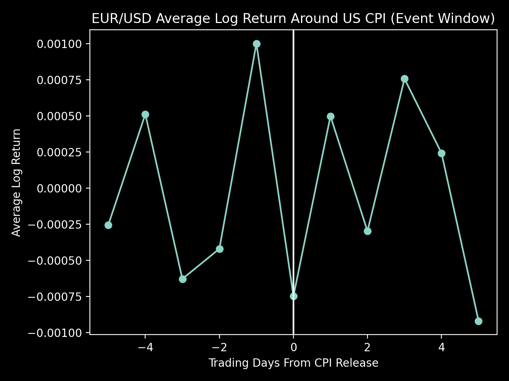
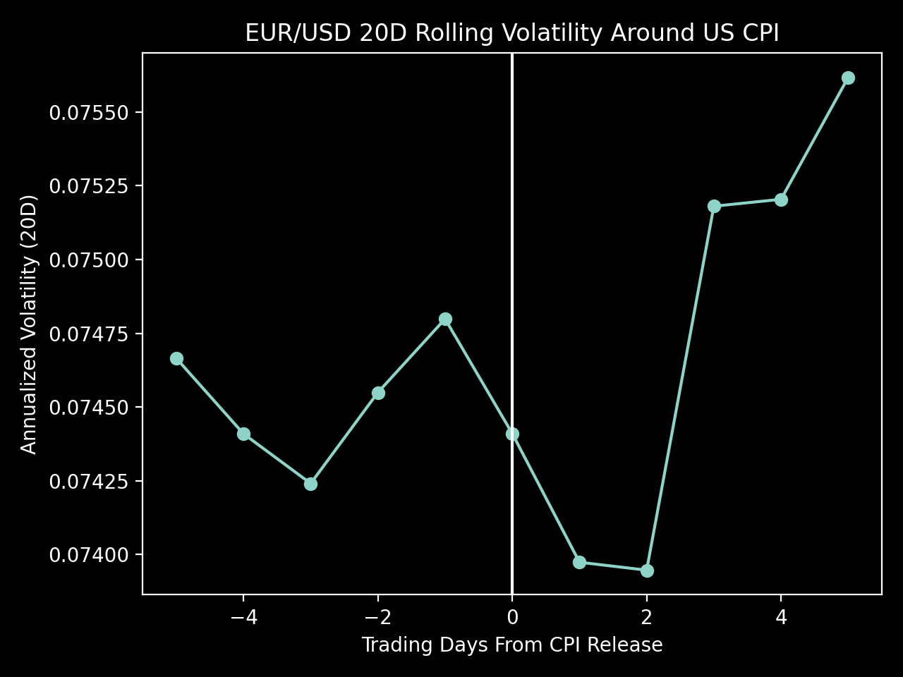

# Analysis: EUR/USD Reaction to US CPI Releases

## Objective
This analysis evaluates how the EUR/USD exchange rate behaves around **US CPI (Consumer Price Index) releases**, with a focus on:

- Directional returns on and around CPI days
- Changes in volatility surrounding the release
- Whether CPI days differ statistically from normal trading days

This objective is not to build a trading strategy, but to understand **market behavior and risk dynamics** around key macroeconomic event.

---

## Data & Event Definition

- **FX Data:** Daily EUR/USD Prices
- **Event Data:** US CPI Dates sourced automatically from FRED (CPIAUCSL)
- **Event Alignment:** CPI Dates mapped to the next available FX trading day
- **Event Window:** +-5 Trading Days around CPI release

CPI observation dates are used as a proxy for release timing, which is appropriate for  daily-frequiency FX Analysis.

---

## Return Behavior Around CPI

Average daily log returns were computed for each trading day in the event window.

The figure above shows the average EUR/USD log return in a +-5 trading-day window around CPI releases. Returns on the event day are slightly negative on average, with no persistent directional pattern before or after the announcement

### Observations
- CPI Release day (Day 0) show **slightly negative average returns**
- No strong or consistent directional pattern emerges before the release
- The sign of returns often reverses within 1-2 days after the event

### Interpretation
EUR/USD does not exhibit persistent abnormal returns around CPI announcements.
This suggests that:
- Inflation information is **rapidly incorporated**
- Directional effects are **small relative to daily FX noise**
- CPI releases alone do not create systematic daily return opportunities

This behavior is consistent with the high liquidity and efficiency of major FX markets.

---

## Volatility Dynamics Around CPI

A 20-day rolling annualized volatility measure was used to capture changes in risk conditions.

The volatility profile indicates that CPI releases primarily affect **risk conditions** rather than direction. Volatility tends to increase after the release, reflecting post-event repricing and adjustment of market expectations.

### Observations
- Volatility does **not spike sharply on the CPI release day**
- Volatility tends to **increase gradually after the event**
- Elevated volatility persists for several days post-release

### Interpretation
Rather than causing immediate shock, CPI releases appear to:
- Trigger **post-event repricing**
- Increase uncertainty as markets adjust expectations for rates and policy
- Affect **risk management conditions** more than short-term direction

This supports the view that macro releases are more relevant for **volatility positioning** than directional trading at daily frequency.

---

## Statistical Testing

A Welch two-sample t-test was conducted to compare:
- CPI event-day returns
- Non-event-day returns (excluding +-5 trading days around CPI)

### Results
- Event-day mean return is more negative than non-event days
- The difference is **not statistically significant at the 5% level**
- Evidence is marginal at the 10% level

### Interpretation
There is **no strong statistical evidence** that CPI days generate abnormal daily returns in EUR/USD.
This reinforces the idea that:
- FX Markets efficiently price widely anticipated macro information
- Observable effects are economically small and statistically weak at daily horizons

---

## Business Implications

From a market and risk perspective:
- CPI releases matter mor for **volatility and positioning** than for directional daily returns
- Risk Managers should expect **elevated post-event uncertainty**
- Traders relying on daily data should avoid assuming systematic CPI-Driven returns

For product or analytics roles, this highlights:
- The importance of **event-based segmentation**
- The need to distinguish **risk effects vs return effects**
- The value of reproducible, automated event pipelines

---

## Limitations & Extensions

### Limitations
- Daily data does not capture **intraday release dynamics**
- CPI observation dates are used instead of exact release timestamps
- No control for surprise magnitude (actual vs forecast)

### Possible Extensions
- Intraday FX reaction analysis
- CPI surprise regression (actual minus consensus)
- Comparison with other macro event (NFP, FOMC)
- Cross-currency Analysis

---

## Conclusion
US CPI releases do not create consistent abnormal daily returns in EUR/USD, but they do influence **volatility and post-event risk conditions**.
This aligns with expectations for a deep, liquid FX market where macro information is rapidly absorbed.

The results suggest CPI is best view as a **risk event**, not a directional signal, at the daily frequency